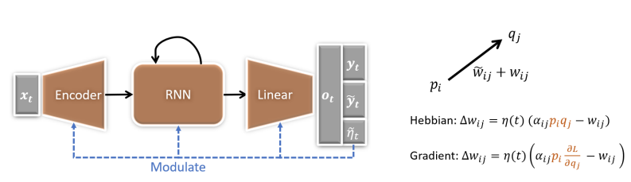
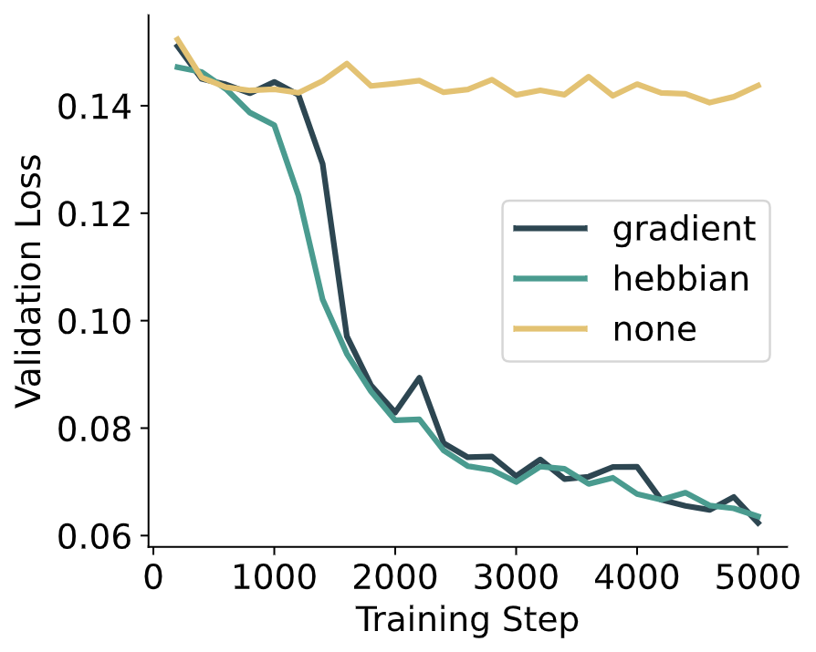

Official implementation of the paper:

[Hebbian and Gradient-based Plasticity Enables Robust Memory and Rapid Learning in RNNs ](https://openreview.net/forum?id=2WklawyeI08)

<p align='center'>
  
</p>

## Installation

Clone the repo:

```bash
git clone https://github.com/yuvenduan/PlasticRNNs
cd PlasticRNNs
```

Install dependencies in a new conda environment:

```bash
conda env create -f environment.yml
conda activate plastic
```

If you are interested in reproducing results on one-shot image classification, download [CIFAR-FS](https://drive.google.com/file/d/1GjGMI0q3bgcpcB_CjI40fX54WgLPuTpS/view) and/or [miniImageNet](https://drive.google.com/file/d/12V7qi-AjrYi6OoJdYcN_k502BM_jcP8D/view). Unzip the datasets and put the files under <code>data/CIFAR_FS</code> and <code>data/miniImageNet</code>. Alternatively, you can change the path to the datasets in <code>datasets/fsc/CIFAR_FS.py</code> and <code>datasets/fsc/mini_imagenet.py</code>.

## Usage

As a demo for the cue-reward association task, run:
```bash
python main.py -t cuereward_demo
```
If you have multiple GPUs on your machine, you can add <code>-s</code> so that experiments could be ran concurrently. If you are using a slurm cluster, you can add <code>-c</code> so that experiments will be submitted to the cluster. 

During training, progress can be found in <code>experiments/cuereward_demo/.../progress.txt</code>. After training, try
```bash
python main.py -a cuereward_demo
```
to plot the training curves. The result is stored as <code>figures/cuereward/curves-demo.pdf</code>.

<p align='center'>
  
</p>

Configurations for all experiments in the paper can be found at <code>configs/experiments.py</code>, whereas the analyses can be found at <code>configs/exp_analysis.py</code>. These experiments and analyses can be ran similarly.

## Acknowledgments

The codebase is based on the code from [Meta-Learning with Differentiable Convex Optimization](https://github.com/kjunelee/MetaOptNet) and [Evolving the olfactory system with machine learning](https://github.com/gyyang/olfaction_evolution).